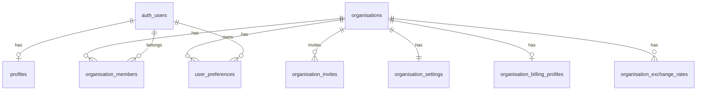
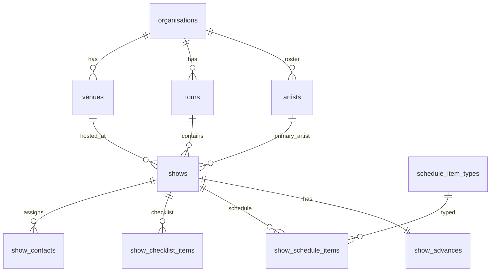
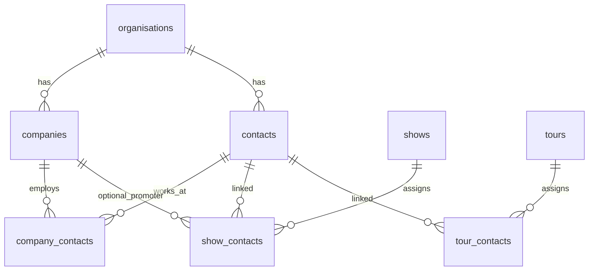
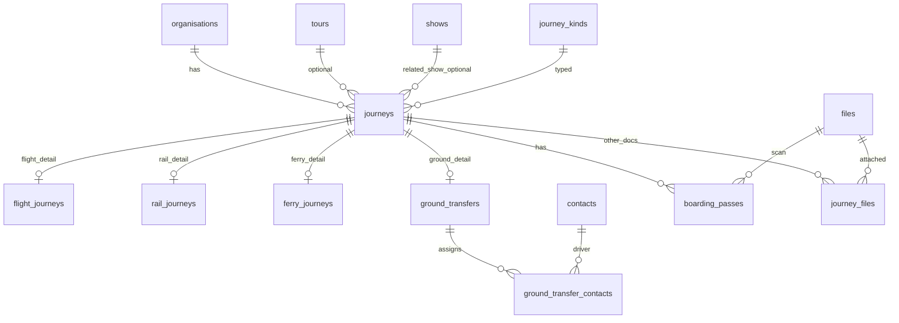
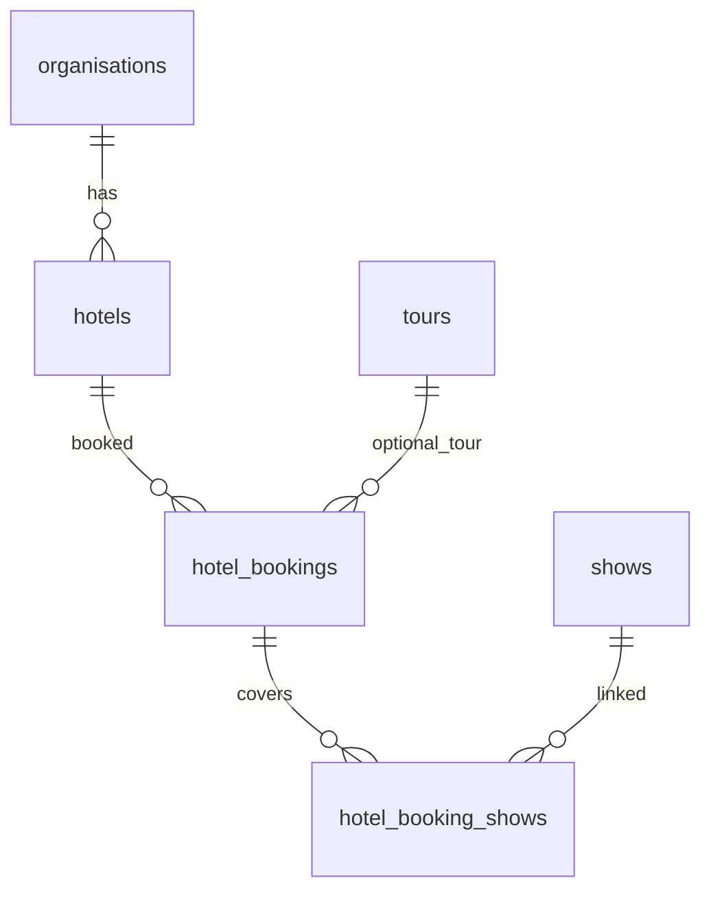
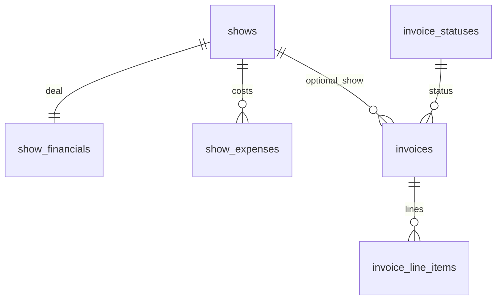
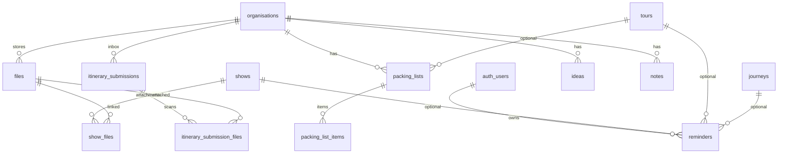
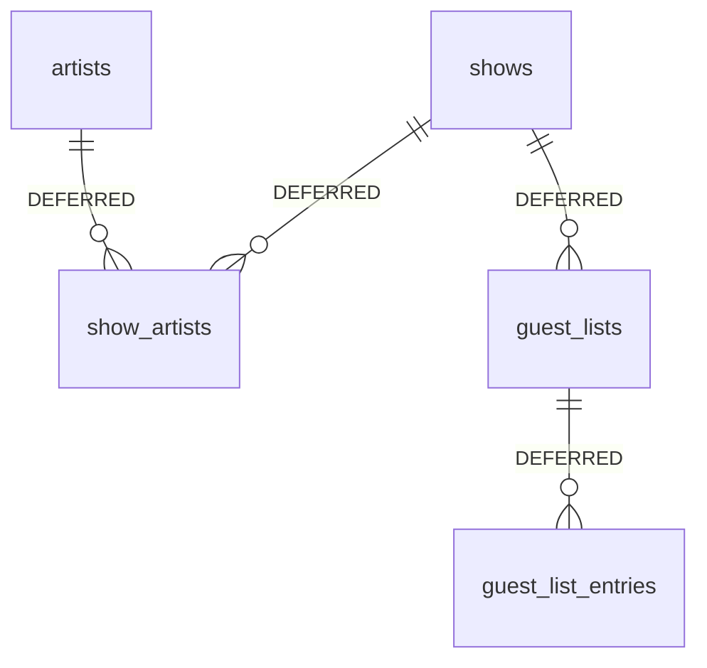
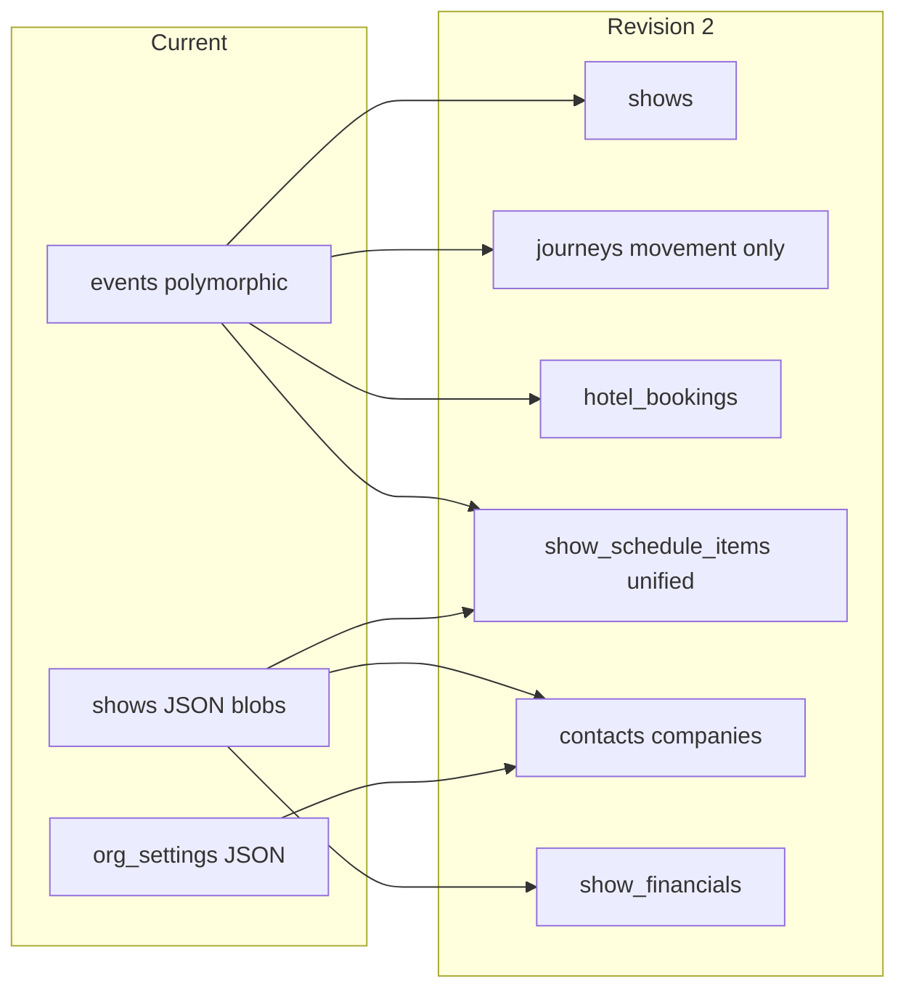

# Operate — Proposed Schema ERD (Revision 2)

Target structure after revision 2. Journeys are **movement only**. Schedules are **one table**. Hotels are **separate from journeys**.

---

## 1. Organisations, users, and access



---

## 2. Artists, tours, venues, shows



**Note:** `show_timeline_steps`, `show_advance_schedule_items`, and show markers are **not** separate tables — all are `show_schedule_items`.

---

## 3. Contacts and companies



---

## 4. Journeys and movement (no hotels, no markers)



**Main route:**

```text
organisations
  → tours
  → shows
      → show_schedule_items
      → show_contacts
      → journeys (optional related_show_id)
          → flight_journeys | rail_journeys | ferry_journeys | ground_transfers
          → boarding_passes → files
          → journey_files (non-pass documents only)
      → hotel_bookings → hotels
                      → hotel_booking_shows (multi-show)
      → show_financials
      → show_checklist_items
```

---

## 5. Hotels (not journeys)



One booking spanning multiple shows uses **multiple rows** in `hotel_booking_shows`, not a forced single `show_id` on the booking.

---

## 6. Finance and invoices



No `invoice_shows`, `show_income`, or `show_payments` in immediate schema.

---

## 7. Files, packing, reminders, content



---

## 8. Deferred (not in immediate build)



---

## Revision 2 vs revision 1

| Removed from journeys | Moved to |
|----------------------|----------|
| Hotel stay | `hotel_bookings` |
| Calendar marker | `show_schedule_items` |

| Merged tables | Into |
|---------------|------|
| `show_timeline_steps` | `show_schedule_items` |
| `show_advance_schedule_items` | `show_schedule_items` |
| Marker logistics | `show_schedule_items` |

| Removed overlap | Resolution |
|-----------------|------------|
| `boarding_passes` + `journey_files` for same pass | `boarding_passes` only |
| `show_flights` parallel model | `journeys` + `flight_journeys` only |
| Org-wide packing JSON | `packing_lists` + items |
| PIN/tab in org settings | Device-local + `user_preferences` |

---

## Current vs target (high level)


