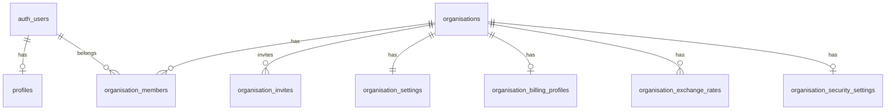
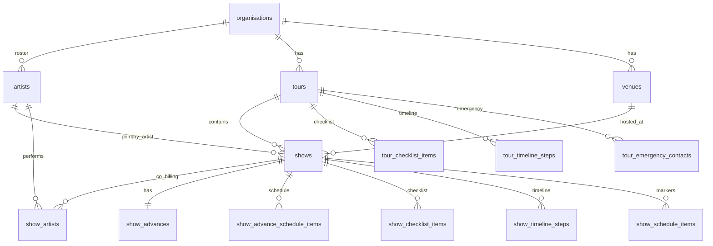
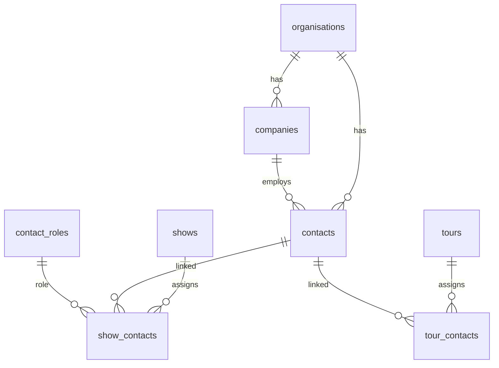
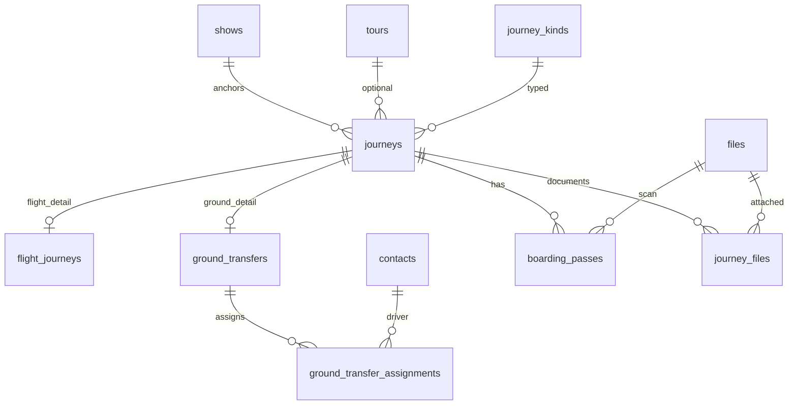
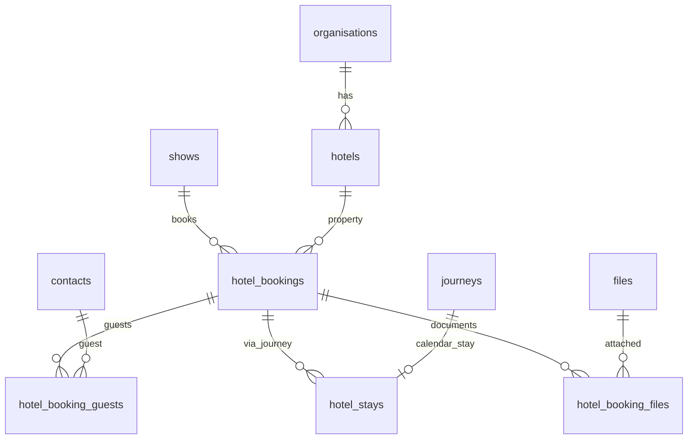
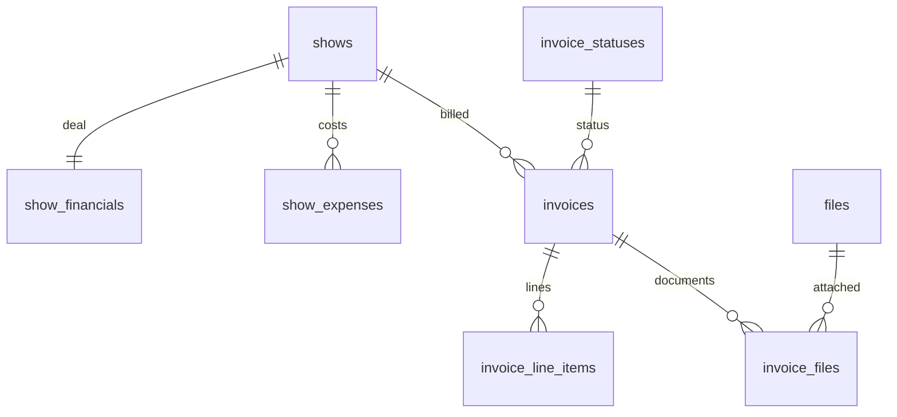
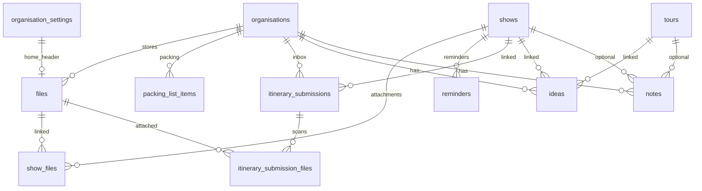
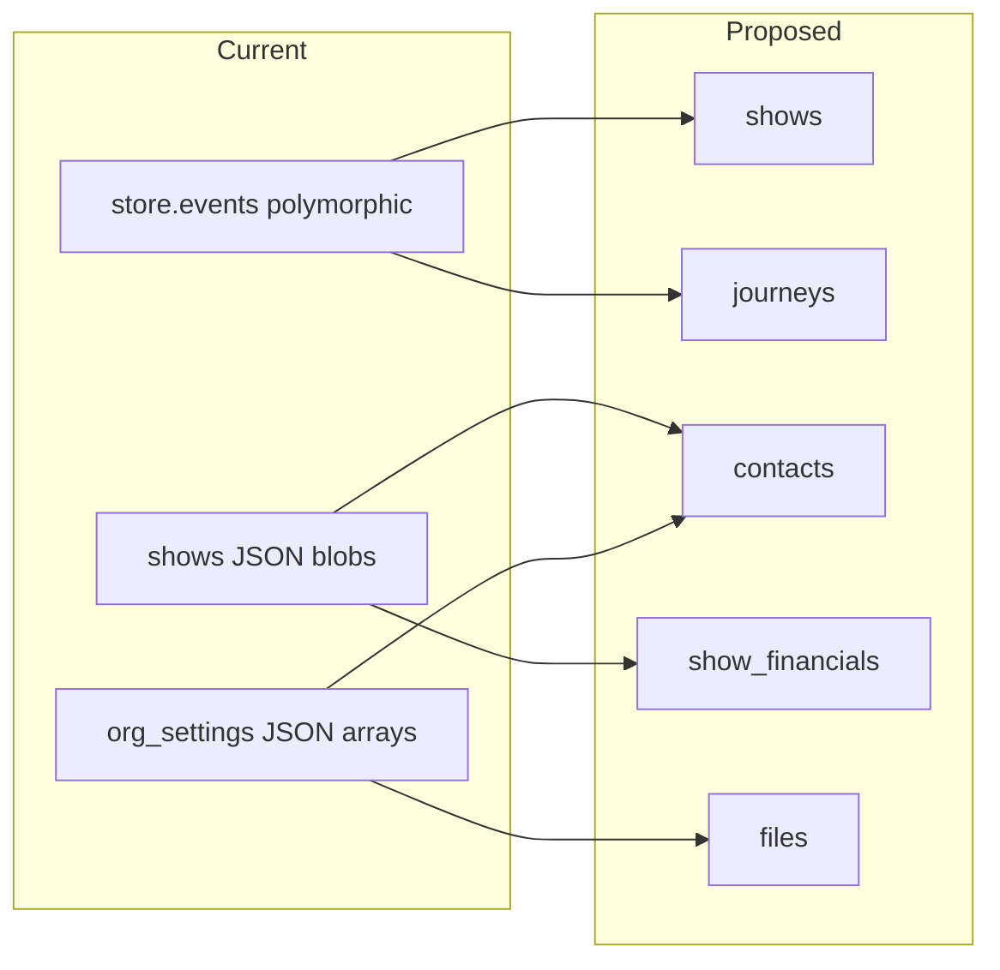

# Operate — Proposed Schema ERD

This diagram reflects the target structure in `proposed-schema.md`. It is divided into logical sections for readability.

---

## 1. Accounts, organisations, and access



---

## 2. Artists, tours, and shows



---

## 3. Contacts, companies, and assignments



---

## 4. Travel, journeys, and boarding passes



**Major route (as requested):**

```text
organisations
  → artists
  → tours
  → shows
      → venues
      → show_schedule_items
      → show_contacts
      → journeys
          → flight_journeys
          → ground_transfers
          → boarding_passes
      → hotel_bookings
      → show_financials
      → show_checklist_items
```

---

## 5. Accommodation



---

## 6. Finance and invoices



---

## 7. Files, ideas, notes, and operations



---

## Relationship notes

| From | To | Cardinality | Delete behaviour |
|------|-----|-------------|------------------|
| shows | tours | N:1 optional | SET NULL on tour delete |
| journeys | shows | N:1 required | CASCADE |
| hotel_bookings | shows | N:1 | CASCADE |
| show_financials | shows | 1:1 | CASCADE |
| boarding_passes | journeys | N:1 | CASCADE |
| show_contacts | contacts | N:1 | RESTRICT (prefer soft-delete contacts) |
| files | organisation | N:1 | CASCADE with storage cleanup job |

---

## Current vs proposed (high-level)



This ERD is the target state after all migration phases complete. During transition, legacy JSON columns remain readable alongside new tables (dual-write period).
